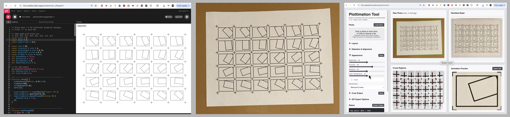
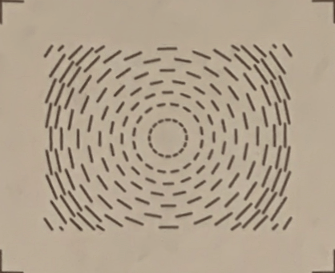

# Plottimation

Free online tool for generating animated GIFs from pen-plotted frame-sheets. 

---

* [**Live Software Tool Online**](https://golanlevin.github.io/plottimation/)
  * [Plottimation source code here](plottimation_webtool/)
* Documentation: 
  * [Instructional demo video on YouTube](https://www.youtube.com/watch?v=MOXB63DgItQ)
  * Some [written instructions here](plottimation_webtool/README.md)
* Example p5.js code for creating plottable animation frame sheets (uses [p5.plotSvg](https://github.com/golanlevin/p5.plotSvg)):
  * In [this repository](grid-animation-svg-generator/sketch.js)
  * At [editor.p5js.org](https://editor.p5js.org/golan/sketches/_ZMbagYFc)

